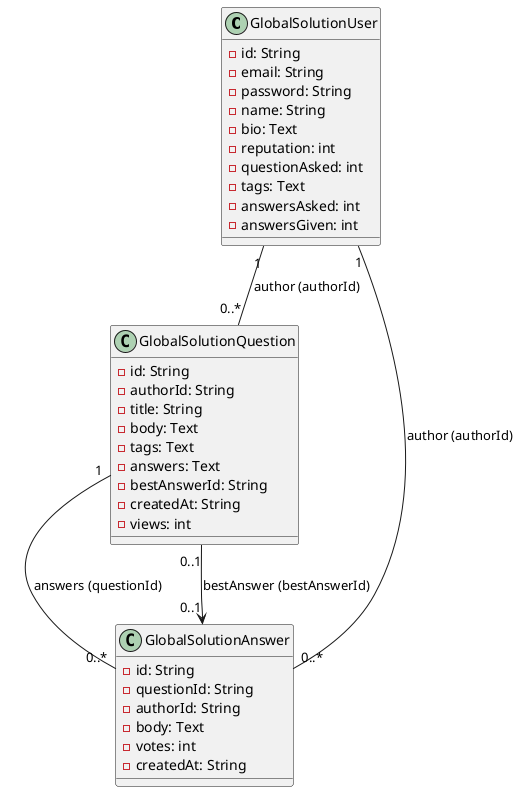

# Global Solution 2025

## Project Overview

The **Global Solution 2025** project is a full-stack application designed to manage a Q&A platform. It consists of a **front-end** built with Next.js and a **back-end** implemented in Java using Jersey (JAX-RS) for RESTful services. The application is supported by an Oracle database for data persistence.

---

## Project Structure

### Front-End
- **Framework**: Next.js (React-based)
- **Styling**: TailwindCSS
- **Key Features**:
  - User authentication and profile management
  - Question and answer management
  - Dynamic routing for user and question pages
- **Dependencies**:
  - Radix UI components
  - React Hook Form for form handling
  - Zod for schema validation
  - TailwindCSS for styling

### Back-End
- **Framework**: Jersey (JAX-RS)
- **Database**: Oracle
- **Key Features**:
  - RESTful APIs for managing users, questions, and answers
  - DAO and Repository patterns for database interaction
  - CORS filter for cross-origin requests
- **Dependencies**:
  - Jackson for JSON processing
  - JUnit for testing
  - Oracle JDBC driver for database connectivity

### Database
- **Schema**:
  - `global_solution_users`: Stores user information
  - `global_solution_questions`: Stores questions
  - `global_solution_answers`: Stores answers
- **Indexes**:
  - Optimized for email, author, and question lookups

---

## Setup Instructions

### Prerequisites
- **Front-End**:
  - Node.js (v16+)
  - PNPM package manager
- **Back-End**:
  - Java 8+
  - Maven
  - Oracle Database

### Steps to Run

1. **Front-End**:
   - Navigate to `global-solution-front/`
   - Install dependencies: `pnpm install`
   - Start development server: `pnpm dev`

2. **Back-End**:
   - Navigate to `global-solution-back/`
   - Configure database connection in `.env`
   - Build the project: `mvn clean install`
   - Run the server: `mvn exec:java`

---

## Demonstrations

### Front-End
- **Home Page**: Displays a list of questions with search functionality.
- **User Profile**: Shows user details and activity.
- **Question Details**: View and answer questions.

### Back-End
- **API Endpoints**:
  - `GET /users`: Fetch all users
  - `POST /questions`: Create a new question
  - `PUT /answers/{id}`: Update an answer

### Back-End API Endpoints

#### User Endpoints
- **POST /user**: Create a new user.
- **POST /user/login**: Authenticate a user.
- **GET /user/{email}**: Retrieve user details by email.
- **GET /user/id/{id}**: Retrieve user details by ID.
- **GET /user/all**: Retrieve all users.
- **DELETE /user/{email}**: Delete a user by email.

#### Question Endpoints
- **POST /question**: Create a new question.
- **GET /question/{id}**: Retrieve question details by ID.
- **GET /question/all**: Retrieve all questions.
- **DELETE /question/{id}**: Delete a question by ID.

#### Answer Endpoints
- **POST /answer**: Create a new answer.
- **GET /answer/{questionId}/{authorId}**: Retrieve an answer by question ID and author ID.
- **GET /answer/all**: Retrieve all answers.
- **GET /answer/{questionId}/all**: Retrieve all answers for a specific question.
- **DELETE /answer/{questionId}/{authorId}**: Delete an answer by question ID and author ID.

---

### UML Class Diagram

Below is the UML class diagram representing the database schema:

---

## License

This project is licensed under the MIT License. See the LICENSE file for details.